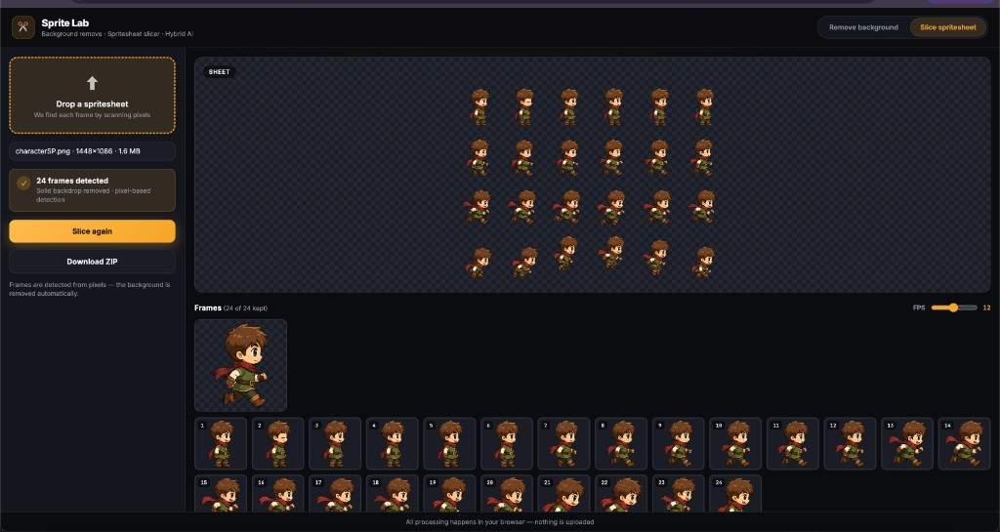
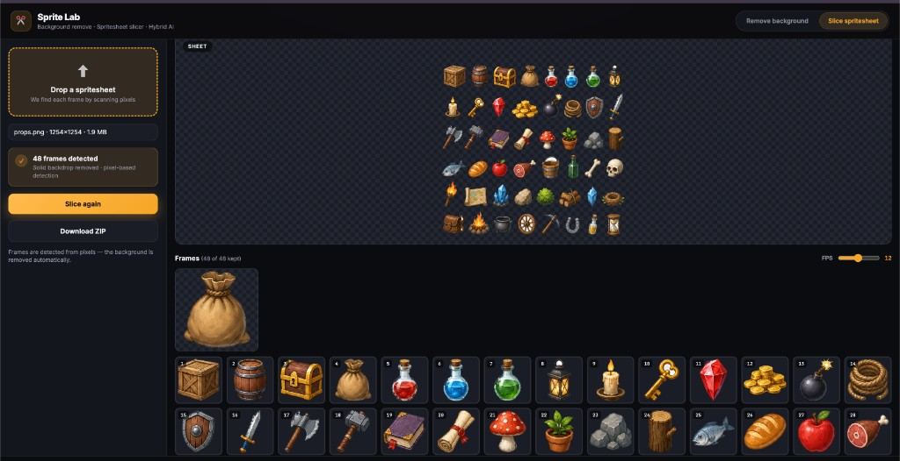

# Sprite Lab

**Remove backgrounds and slice spritesheets** — entirely in your browser. Nothing is uploaded to a server, no AI models, no downloads.

Sprite Lab detects the backdrop of an image (magenta, green screen, checkerboard, or solid), removes it with a multi-pass alpha-matting pipeline that eliminates edge halos, then slices a spritesheet into individual frames by scanning connected pixels.

---

## Screenshots

Slicing a character animation sheet — 24 frames detected automatically, with a live animation preview:



Slicing a dense item/props atlas — 48 frames detected from a single sheet:



---

## Features

### Remove background
- **Automatic** — detects checkerboard, green screen, magenta, or solid backdrops and removes them
- **Multi-pass alpha matting** — recovers true edge coverage and decontaminates background spill, so there are no white/grey halos around sprites
- Before / after preview on a transparency checkerboard
- Download as PNG

### Slice spritesheet
- **Pixel-based frame detection** — finds each sprite by scanning connected pixels, never blind grid slicing
- Background removed automatically when detected
- Animation preview with adjustable FPS
- Click frames to exclude them from export
- **ZIP export** with individual frames, a recomposed horizontal strip, and `manifest.json`

### 100% local
- Pure pixel processing via the Canvas API — no machine-learning models, no network calls
- Fully deterministic: the same input always produces the same output
- Works offline

---

## Quick start

```bash
git clone https://github.com/boona13/sprite-lab.git
cd sprite-lab
npm install
npm run dev
```

Open the local URL printed by Vite (e.g. **http://localhost:5173**).

### Production build

```bash
npm run build
npm run preview
```

Deploy the `dist/` folder to any static host (GitHub Pages, Netlify, Vercel, etc.). No backend required.

---

## How it works

1. **Backdrop detection** samples the image borders and color distribution to classify the background (`magenta`, `green`, `checkerboard`, `solid`, `transparent`, or `none`).
2. **Removal** is routed by type — chroma key for magenta/green, border flood-fill for solid/white, and a checkerboard matte for transparency previews.
3. **Multi-pass alpha matte** treats each silhouette pixel as a blend `C = α·F + (1−α)·B`, estimates the local foreground `F` and background `B`, solves for coverage `α`, and decontaminates the color. It iterates inward, peeling one ring of halo per pass until it reaches true sprite color.
4. **Frame extraction** builds an alpha mask, finds connected components, and crops each to its own padded frame.

The full pipeline is shared between the browser app and a set of headless CLI tests:

```bash
npm run test:pipeline -- path/to/spritesheet.png   # end-to-end, writes frames to disk
npm run test:checkerboard                           # checkerboard + drop-shadow case
npm run test:halo                                   # light-halo matte case
```

---

## Export manifest

The ZIP includes a `manifest.json` describing every frame:

```json
{
  "version": 1,
  "frameCount": 24,
  "fps": 12,
  "loop": true,
  "strip": { "fileName": "strip.png", "sheetWidth": 4096, "sheetHeight": 512 },
  "frames": [
    { "index": 0, "fileName": "frame_01.png", "width": 170, "height": 200, "sourceX": 12, "sourceY": 8, "stripX": 0 }
  ]
}
```

---

## Tech stack

| Layer | Technology |
|-------|------------|
| UI | Vite, TypeScript, CSS |
| Image processing | HTML Canvas (client-side) |
| Frame export | JSZip |
| CLI tests | tsx, sharp |

---

## License

[MIT](LICENSE)
